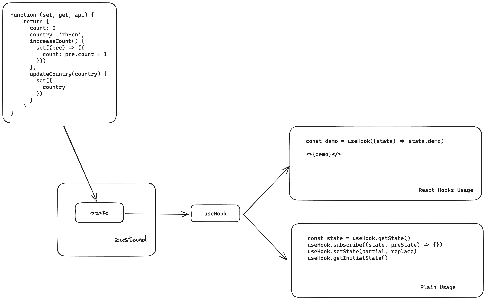

# {frontmatter.title}

描述：{frontmatter.description}

## 起因

工作对接中旧有项目使用了`zustand`这个状态管理库，为了增加 对这个库的了解，我们来一步步还原它的核心功能。

## 使用

我们先使用`zustand`这个库，以下为本次需要实现的例子 [表情]

```jsx
// index.jsx

import { useCounter } from "./store/counter";

function ClickButton() {
  const count = useCounter((state) => state.count);

  const increaseCount = useCounter((state) => state.increaseCount);

  console.log("Zustand ClickButton render");

  return (
    <div>
      <span>{count}</span>

      <button
        className="px-2 py-1 border border-black rounded-md cursor-pointer"
        onClick={() => increaseCount()}
      >
        Increase Count
      </button>
    </div>
  );
}

function CountCountry() {
  const country = useCounter((state) => state.country);

  const updateCountry = useCounter((state) => state.updateCountry);

  console.log("Zustand CountCountry render");

  return (
    <div>
      <span>{country}</span>

      <button
        className="px-2 py-1 border border-black rounded-md cursor-pointer"
        onClick={() => updateCountry(`${Math.random()}`)}
      >
        updateCountry
      </button>
    </div>
  );
}

export default function App() {
  return (
    <>
      <ClickButton />

      <CountCountry />
    </>
  );
}
```

```jsx
// store/counter.js

import { create } from "zustand";

export const useCounter = create((set) => ({
  count: 0,

  country: "zh-cn",

  increaseCount() {
    set((pre) => ({
      count: pre.count + 1,
    }));
  },

  updateCountry(country) {
    set({
      country,
    });
  },
}));
```

以上使用`zustand`的 `create Api`， 同时用了 `selectors` 进行 `Render Optimization`。

### 结果展示

import NormalUsage from "./demo/normal";

<NormalUsage client:load />

可以尝试点击按钮，查阅调试器(Devltools Console 窗口)初始化渲染会输出 `Zustand ClickButton render` 和 `Zustand CountCountry render`。如果未使用 `selectors`， 则该 `counterStore` 任意更新，都会触发调用该 `hooks` 的组件重新渲染。

因为当前示例使用了 `selectors` ，所以当我们更新 `counterStore`的具体值的时候， 只有被引用的组件才会被重新渲染。

#### Tips

`selectors` 的使用方式需要返回具体的属性，如果返回的是对象，并不会进行 `Render Optimization`。 例如以下代码：

```jsx
const { country, updateCountry } = useCounter((state) => ({
  country: state.country,

  updateCountry: state.updateCountry,
}));
```

如果想减少 `zustand selectors` 的写法，官方也有建议方式，[Auto Generating Selectors](https://docs.pmnd.rs/zustand/guides/auto-generating-selectors)

## 思路

让我们一起梳理下使用流程



## 实现

根据以上使用逻辑以及参考源码，我们从 `Plain Usage` 和 `React Hooks Usage`

### Plain Usage

我们先实现 Plain Usage 的场景，代码如下：

```jsx
import { useEffect, useState } from "react";

function create(fn) {
  const lisCb = [];

  const api = {
    getState() {
      return store;
    },

    subscribe(cb) {
      lisCb.push(cb);

      const index = lisCb.length;

      return () => {
        lisCb.splice(index - 1, 1);
      };
    },

    setState(partial) {
      const oldState = store;

      let newState;

      if (typeof partial === "function") {
        newState = partial(oldState);
      } else newState = partial;

      store = Object.assign({}, oldState, newState);

      lisCb.forEach((cb) => cb(store, oldState));
    },

    getInitialState() {
      return initState;
    },
  };

  const initState = fn(api.setState, api.getState);

  let store = initState;

  function useHook(selectorFn) {
    return selectorFn();
  }

  return Object.assign(useHook, api);
}

const useHookStore = create(() => ({
  count: 1,
}));

export default function App() {
  const [count, setCount] = useState(useHookStore.getInitialState().count);

  useEffect(() => {
    const unSubs = useHookStore.subscribe((state, pre) => {
      setCount(state.count);
    });

    return () => {
      unSubs();
    };
  }, []);

  return (
    <div>
      <div>{count}</div>

      <button
        className="px-2 py-1 border border-black rounded-md cursor-pointer"
        onClick={() =>
          useHookStore.setState((pre) => ({ count: pre.count + 1 }))
        }
      >
        add count
      </button>
    </div>
  );
}
```

#### 结果展示

如上述代码所示，当只使用 订阅 模式监听数据变化，我们也可以简单实现 视图 响应效果。

import InitFrame from "./demo/frame";

<InitFrame client:load />

### React Hooks Usage

如何实现 `const count = useHookStore(state => state.count)` 的效果呢？

这里主要涉及到一个 `Api` 叫做 [useSyncExternalStore](https://react.dev/reference/react/useSyncExternalStore)，我们重新实现处理下，代码如下：

```jsx
// index.jsx

import { useCounter } from "./store/counter";

function ClickButton() {
  const count = useCounter((state) => state.count);

  const increaseCount = useCounter((state) => state.increaseCount);

  console.log("useSyncExternalStore ClickButton render");

  return (
    <div>
      <span>{count}</span>

      <button
        className="px-2 py-1 border border-black rounded-md cursor-pointer"
        onClick={() => increaseCount()}
      >
        Increase Count
      </button>
    </div>
  );
}

function CountCountry() {
  const country = useCounter((state) => state.country);

  const updateCountry = useCounter((state) => state.updateCountry);

  console.log("useSyncExternalStore CountCountry render");

  return (
    <div>
      <span>{country}</span>

      <button
        className="px-2 py-1 border border-black rounded-md cursor-pointer"
        onClick={() => updateCountry(`${Math.random()}`)}
      >
        updateCountry
      </button>
    </div>
  );
}

export default function App() {
  return (
    <>
      <ClickButton />

      <CountCountry />
    </>
  );
}
```

```jsx
// store/counter.js

import { create } from "./create-store";

export const useCounter = create((set) => ({
  count: 0,

  country: "zh-cn",

  increaseCount() {
    set((pre) => ({
      count: pre.count + 1,
    }));
  },

  updateCountry(country) {
    set({
      country,
    });
  },
}));
```

```jsx
// store/create-store.js

import { useSyncExternalStore } from "react";

// import { useSyncExternalStoreWithSelector } from './use-sync-with-selector'

function exposeApi(fn) {
  const lisCb = [];

  const initState = fn(setState, getState);

  let store = initState;

  function setState(partial) {
    const oldState = store;

    let newState;

    if (typeof partial === "function") {
      newState = partial(oldState);
    } else newState = partial;

    store = Object.assign({}, oldState, newState);

    lisCb.forEach((cb) => cb(store, oldState));
  }

  function getState() {
    return store;
  }

  function subscribe(cb) {
    lisCb.push(cb);

    const index = lisCb.length;

    return () => {
      lisCb.splice(index - 1, 1);
    };
  }

  function getInitialState() {
    return initState;
  }

  const api = {
    initState,

    subscribe,

    getState,

    getInitialState,
  };

  return api;
}

export function create(fn) {
  const api = exposeApi(fn);

  function useHook(selector) {
    return useSyncExternalStore(
      api.subscribe,

      typeof selector === "function"
        ? () => selector(api.getState())
        : api.getState,

      api.getInitialState,
    );

    // return useSyncExternalStoreWithSelector(

    // api.subscribe,

    // api.getState,

    // api.getInitialState,

    // selector

    // )
  }

  return Object.assign(useHook, api);
}
```

#### 结果展示

import WithoutSelector from "./demo/self-zustand";

<WithoutSelector client:only />

#### Tips

以上已经达到了类似 `Render Optimization` 的效果，但是还是会有些问题，大家可以自行尝试下以下使用方式:

```js
const { count, increaseCount } = useCounter((state) => ({
  count: state.count,

  increaseCount: state.increaseCount,
}));
```

上述问题是 返回值不是一个具体字段，而是一个对象的原因造成的。[useMutableSource → useSyncExternalStore](https://github.com/reactwg/react-18/discussions/86) 中，提及到 `inline getSnapshot`使用方式如下.

```js
// Selecting a specific field using an inline getSnapshot

const selectedField = useSyncExternalStore(
  store.subscribe,

  () => store.getSnapshot().selectedField,
);
```

官方为了方便起见其实也提供了另外一个包 [use-sync-external-store](https://www.npmjs.com/package/use-sync-external-store)这个包。

> As a convenience, we will provide a version of the API with automatic support for memoizing the result of getSnapshot:

```js
// Name of API is not final

import { useSyncExternalStoreWithSelector } from "use-sync-external-store/with-selector";

const selection = useSyncExternalStoreWithSelector(
  store.subscribe,

  store.getSnapshot,

  getServerSnapshot,

  selector,

  isEqual,
);
```

`zustand`也是使用了这个包。`useSyncExternalStoreWithSelector` 内部调用了 `useSyncExternalStore` 方法，只是再对 `getSnnapshot` 做了些额外优化处理，有需要了解可自行再去浏览源码。

## 优缺点

| 方案    | 优点                                                                                                                                                                                  | 缺点                                                                                                                                                                          |
| ------- | ------------------------------------------------------------------------------------------------------------------------------------------------------------------------------------- | ----------------------------------------------------------------------------------------------------------------------------------------------------------------------------- |
| zustand | 相较于 context 使用更简单，而且适用于 `many components throughout the tree`，可以看这个 [RFCS](https://github.com/reactjs/rfcs/blob/main/text/0147-use-mutable-source.md#context-api) | 目前 selector 只支持具体某个属性，手动写会比较繁琐，需要再提供个 `helper function` [Auto Generating Selectors](https://docs.pmnd.rs/zustand/guides/auto-generating-selectors) |
